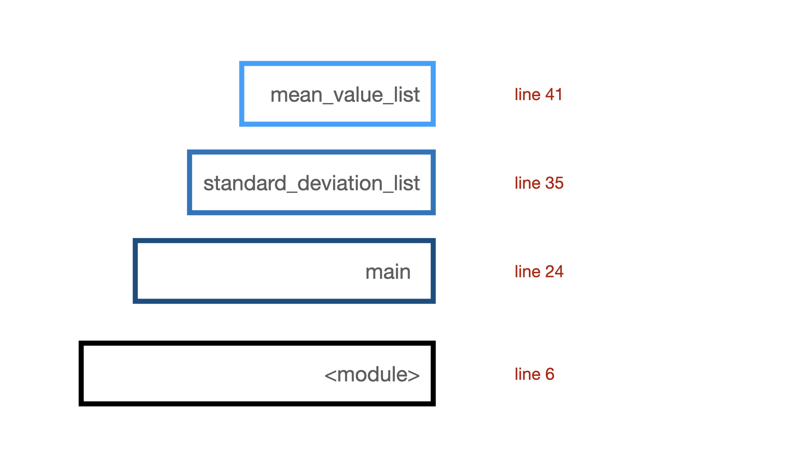

<!-- _class: lead -->

# Learning from Errors: 
# Understanding and Debugging Python Errors


### Dorota Jarecka
McGovern Institute for Brain Research, MIT (Cambridge, MA)

---
# Main theme of the presentation


-  errors / bugs
-  debugging

## Why?

- because most tutorials shows you how to write code that works
- in real life you spend more time dealing with bugs than  writing a new code...


---
# Outline

- ### Python Errors

- ### Traceback

- ### Python debugger

- ### Avoiding bugs and discussion

---
# Format

- ### Presentation

- ### Live Coding

- ### Hands-on Exercises / Pair Coding

- ### Discussion

### Feel free to interrupt me at any time!!


---

# What is debugging?

- investigating why the program is not working properly
- fixing the issues

---

### When does the program not work properly?

- returns an error
- returns results that differ from what you expected
- keep running and doesn't return anything

---
# Errors in Python

- Syntax Errors

- Exception Errors

    - FileNotFoundError
    - AssertionError
    - ZeroDivisionError

---
# Syntax Errors
```
  File ~/teaching/pycon_debugging/part1/syntax.py:1
    a = 3 * (4 + 6
                  ^
SyntaxError: incomplete input
```

```
  File "/Users/dorota/teaching/pycon_debugging/part1/syntax_2.py", line 1
    for i in range(2)
                     ^
SyntaxError: expected ':'
```

---
# Exception Errors

```
Traceback (most recent call last):
  File "/Users/dorota/teaching/pycon_debugging/part1/division.py", line 1, in <module>
    1 / 0
ZeroDivisionError: division by zero
```

```
Traceback (most recent call last):
  File "/Users/dorota/teaching/pycon_debugging/part1/assert.py", line 1, in <module>
    assert 1 + 2 < 3
AssertionError
```

---
# Python Traceback 


```
Traceback (most recent call last):
  File "/Users/dorota/teaching/pycon_debug/part2/standard_deviation.py", line 41, in <module>
    main(filename)
  File "/Users/dorota/teaching/pycon_debug/part2/standard_deviation.py", line 35, in main
    std = standard_deviation_list(data)
  File "/Users/dorota/teaching/pycon_debug/part2/standard_deviation.py", line 24, in standard_deviation_list
    mean = mean_value_list(data_list)
  File "/Users/dorota/teaching/pycon_debug/part2/standard_deviation.py", line 6, in mean_value_list
    return sum(data_list) / len(data_list)
ZeroDivisionError: division by zero

```
- show a Python call stack at the point the exception was raised 

---

# Python call stack


 
 ---


# pdb - the Python debugger

-  interactive source code debugger

- part of the Python's standard library

- allows to stop and exammine running code

- two main ways of using `pdb`:

    - start the program with the debugger: 
    `python -m pdb code.py`

    - stop the program and invoke the debugger:
    `import pdb; pdb.set_trace` or `breakpoint()` (in Python 3.7+)
---
# using the interactive debugger

after inoking the debugger using `breakpoint()` in the code:

```
> /Users/dorota/teaching/pycon_debug/part2/standard_deviation.py(24)std_dev()
-> mean = sum(data_list) / N
(Pdb) 
```

- `q` - quit the debugger

- `c(ontinue)` - continue execution until the next breakpoint


---
# pdb commands: continue and step

- `n(ext)` - continue execution until the next line in the current function

- `s(tep)` - execute the current line, steps inside a called function

- `c(ontinue)` - continue execution until the next breakpoint

- `b <line number, name of function>` - adding new breakpoint

- `<enter>` - repeating the last command
- `<upper arrow>` - search the commands history


---
# pdb commands: check the stack trace

- `w(here)` - print a stack trace, with the most recent frame at the bottom

- `u(p)` - move the current frame one level up

- `d(own)` - move the current frame one level down

Check full description of `up` / `down` and more commands [here](https://docs.python.org/3.10/library/pdb.html) 


---
# pdb: variables listing

- `locals()` - display all the local variables

- `globals()` - display all the global variables

- `display var` (pdb command) - track the changes of variable var

---
# pdb: additional checks

- Python functions
    - `dir()`, `dir(obj)`
    - `type(obj)`

- [`inspect` module](https://docs.python.org/3/library/inspect.html)
    - provides functions to get information about live objects such as modules, classes, functions, tracebacks, etc.
    - `inspect.getdoc` - getting the documentation
    - `inspect.signature` - checking function signature


---
# Can pdb be even better?

- ### pdb++
    - a drop-in replacement for pdb
    - adds new features to make debugging experience nicer
        - syntax highlighting of code
        - TAB completion of Python expressions

    - can be installed with `pip`: `pip install pdbpp`

- ### check debugging option in your favorite IDE

---
# How to avoid bugs?

- don't change too many things at the same time

- use Version Control System (e.g. Git) to track your changes

- write good test suits and use Continuous Integration

- test your code with various versions of python and libraries

- use [`try / except`](https://docs.python.org/3/tutorial/errors.html) in your code to handle possible errors

- try to write clean code and follow Python convention (PEP8), use `pycodestyle`, `black`, etc., to check and fix your style

---
# Final thoughts on debugging

- try to understand the root of your problems
    - e.g. perhaps the directory that is passed to your function should never be empty? perhaps you have some connection issues?

- don't change unrelated things when debugging

- you should combine debugging with reading the code 

- debugging can take a lot of time - take breaks, but make notes

- try to add tests that cover the issue next time

---
# Additional Resources

- [RealPython: Python debugging with PDB](https://realpython.com/python-debugging-pdb/#essential-pdb-commands)

- [Adventures in Python Debugging](https://pythondebugging.com/)